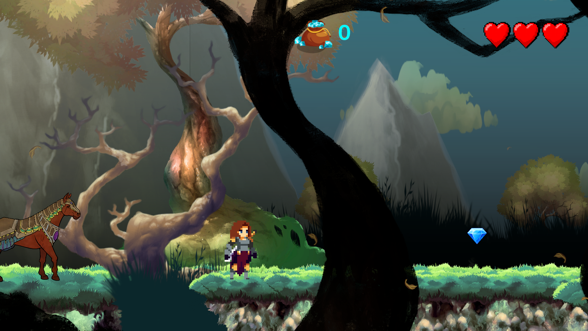
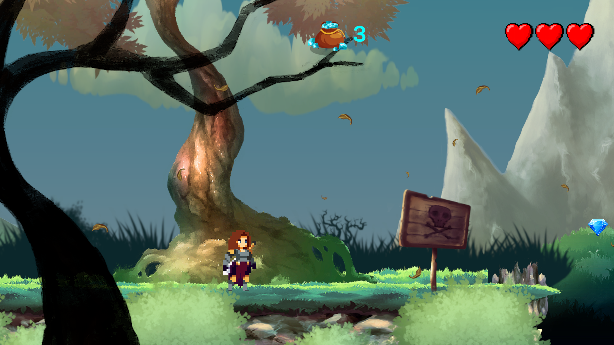
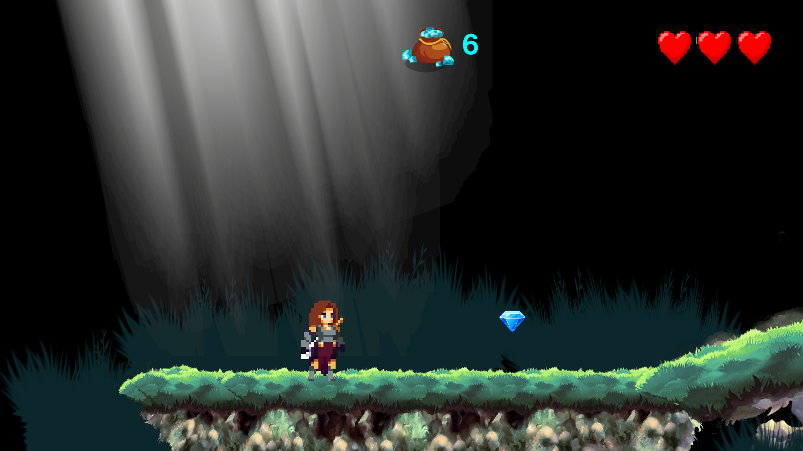
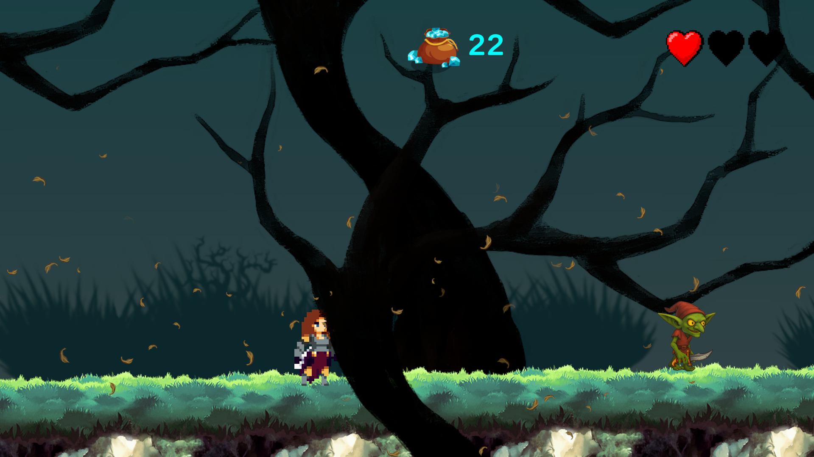
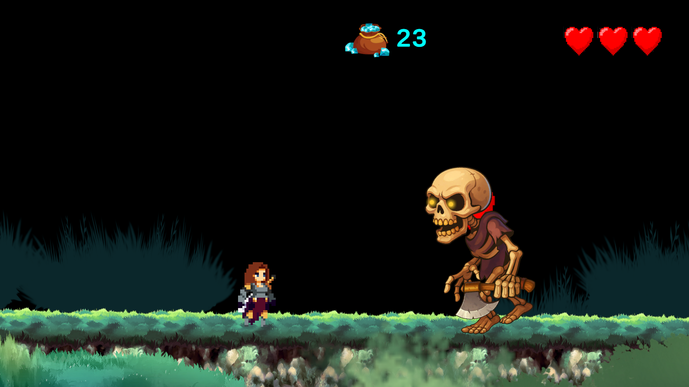
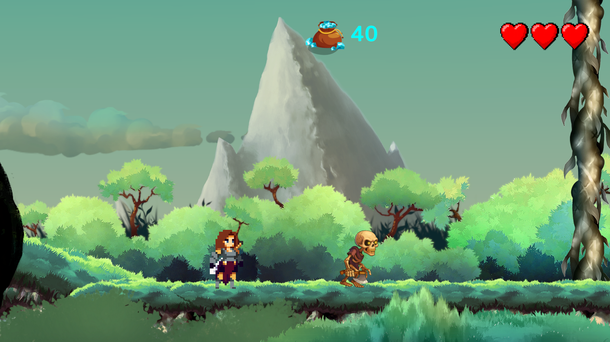

# Game Valkyrie's Rise

## Description

**Valkyrie's Rise** is a 2D action-platformer game in which players control an aspiring Valkyrie named Ana on a quest to prove her worthiness. The game features combat, exploration, and platforming challenges. It consists of five levels, each offering unique environments and different obstacles to overcome.

## Mechanics

In this game, players can jump, run, climb, and attack enemies. It also includes a health system, allowing players to take damage and lose health points when hit by enemies, as well as a diamond collection system that rewards exploration throughout the levels.

## Controls

- **Move Left/Right:** Use the **A** key to move the Valkyrie left and the **D** key to move right.
- **Jump:** Press the **Spacebar** to make the Valkyrie jump.
- **Climb:** Press the **W** or **S** key to climb ladders or other vertical surfaces.
- **Attack:** Press the **Left Mouse Button** to perform an attack.

## How to Play

1. Download the game from this page.
2. Extract the downloaded file.
3. Open the game executable.
4. Use the controls to navigate through the levels, defeat enemies, and collect diamonds.

## Screenshots

Level 1 - Lost in the Forest:

 

Level 1 - Lost in the Forest:

 

Level 2 - Cave of Shadows:

 

Level 3 - Dark Forest:

 

Level 4 - Big Boss Fight:

 

Level 5 - A Way to Escape:

 

## Development

The game was developed using the Unity game engine, with C# as the programming language. The art assets were created using a combination of pixel art and hand-drawn illustrations.

## Assets Used in the Game

- **Main Character (Ana):** A pixel art sprite representing the Valkyrie protagonist.
  Link: https://assetstore.unity.com/packages/2d/characters/warrior-free-asset-195707

- **Level Design:** Various pixel art tilesets and backgrounds used to create the different environments in the game.
  Link: https://assetstore.unity.com/packages/2d/environments/2d-forest-sprite-pack-216237

- **Horse:** A pixel art sprite representing the horse ridden by the Valkyrie.
  Link: https://assetstore.unity.com/packages/2d/characters/greek-fantasy-enemies-204779

- **Enemies:** Various pixel art sprites representing the enemies encountered throughout the game.
  Link: https://assetstore.unity.com/packages/2d/characters/dark-fantasy-popular-enemies-free-sample-327389

- **Music:** Background music tracks that enhance the atmosphere and immersion of the game.
  Link: https://assetstore.unity.com/packages/audio/music/fantasy-game-music-the-shimmering-expanse-rpg-music-pack-321382

- **Diamonds:** Pixel art sprites representing collectible diamonds scattered throughout the levels.
  Link: https://assetstore.unity.com/packages/2d/gui/icons/coins-crystals-diamonds-vector-icons-for-iap-163473

## Tutorials That Helped in the Development

- Unity 2D Platformer for Complete Beginners
  https://www.youtube.com/playlist?list=PLgOEwFbvGm5o8hayFB6skAfa8Z-mw4dPV

- Unity MELEE COMBAT in 140 Seconds – Unity 2D Beginner Tutorial
  https://www.youtube.com/watch?v=Lm7Uh88uQM8